# Use following instructions to build the examples:
 
* Download GraalVM 19.3.0 from https://www.graalvm.org/downloads.
* Extract the tarball and set `JAVA_HOME` to the GraalVM release directory.
* Install native-image with `$JAVA_HOME/bin/gu install native-image`.
* Change to the example subdirectories and run `mvn package` there.
* Once you are done with building both images run:
  * `$JAVA_HOME/bin/native-image --server-shutdown`
* The built executables are:
  * `configure-at-runtime-example/target/configureatruntime`
  * `configure-at-buildtime-example/target/configureatbuildtime`

# Demo run:

